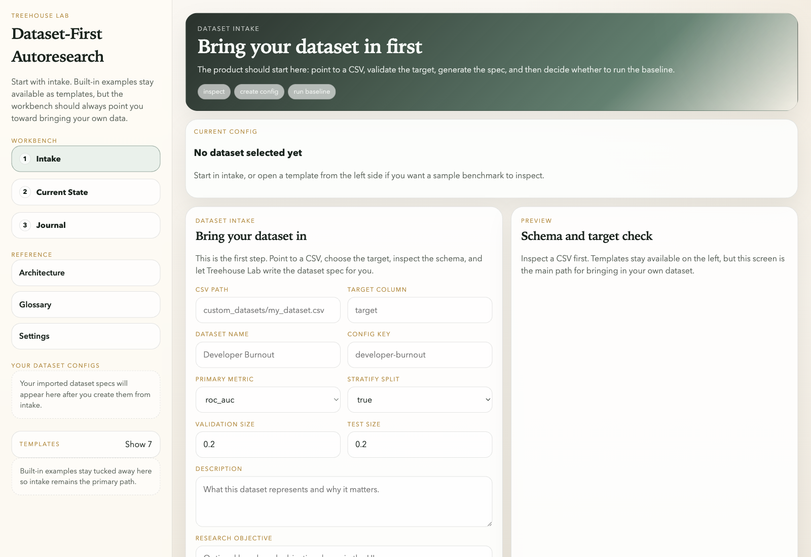
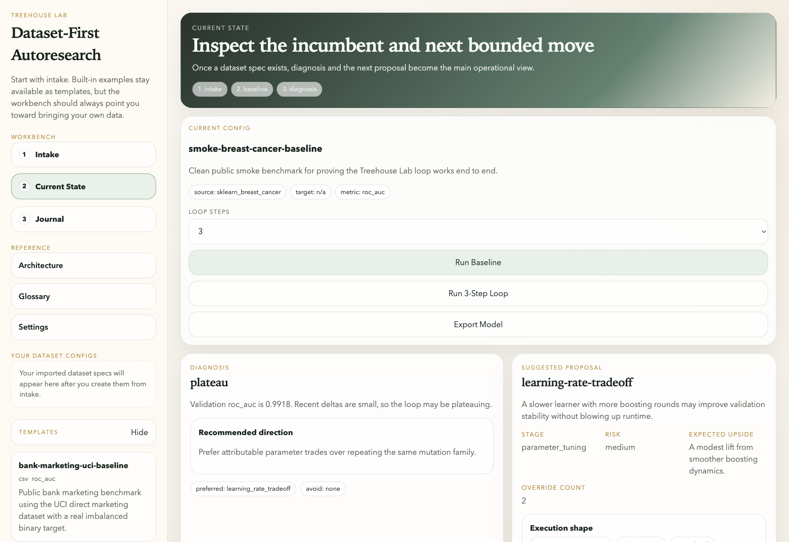
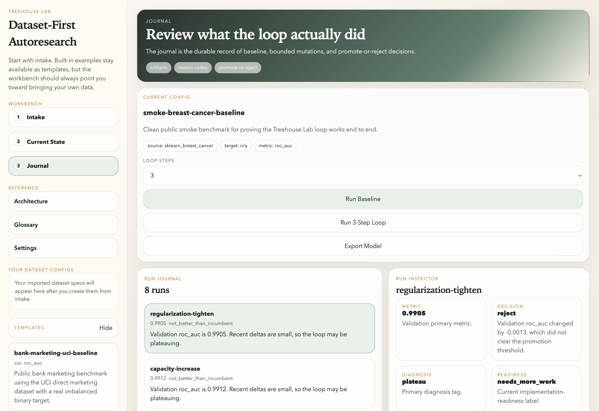
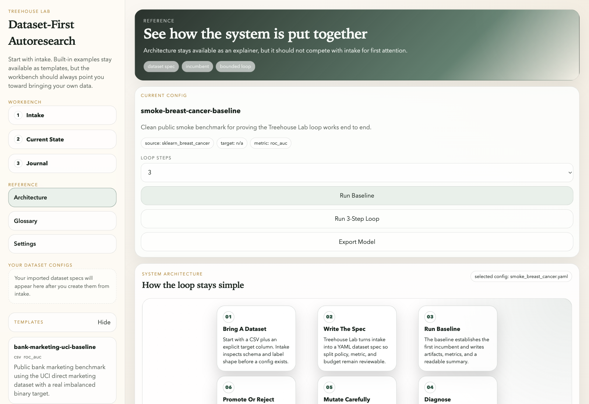

# Walkthrough

Treehouse Lab should be usable without reverse-engineering the repo.

This page is the shortest practical path through the current `v1.2.x` product:

1. bring a dataset through intake
2. establish or inspect an incumbent
3. run a short bounded loop
4. understand whether the result is merely benchmark progress or actually implementation-ready

## What This Walkthrough Covers

The current product surface is:

- dataset-first intake
- bounded XGBoost-first baseline / diagnose / propose / loop flow
- React workbench for intake, current state, journal, settings, and architecture
- optional compare harness against plain XGBoost, AutoGluon, and FLAML

This is not a hosted platform or a broad AutoML suite. The point is to make tabular autoresearch bounded and reviewable.

## Fast Local Path

Install the local web flow:

```bash
pip install -e '.[web,llm]'
cd frontend
npm install
cd ..
```

Start the API:

```bash
treehouse-lab-api
```

Start the frontend in a second terminal:

```bash
cd frontend
npm run dev
```

Then open:

- frontend: `http://127.0.0.1:5173/`
- API health: `http://127.0.0.1:8000/api/health`

## Workflow

### 1. Start In Intake

The intended first step is always intake.

Use your own CSV when possible. Point Treehouse Lab at:

- the CSV path
- the target column
- a config name and key

Then:

- click `Inspect CSV` to validate the target and preview the dataset contract
- click `Create Config` to write the dataset spec
- or click `Create + Run Baseline` if you want the first incumbent immediately

The important product decision is that Treehouse Lab should generate the dataset YAML for the user. Intake is supposed to remove spec-writing friction, not create it.

### 2. Establish Or Inspect The Incumbent

Once a config exists, the `Current State` view becomes useful.

That view is where you inspect:

- the current incumbent metric
- whether the current run is implementation-ready
- the diagnosis
- the next bounded proposal
- recent coach or loop context

If you prefer CLI-first work, the equivalent commands are:

```bash
treehouse-lab baseline configs/datasets/smoke_breast_cancer.yaml
treehouse-lab diagnose configs/datasets/smoke_breast_cancer.yaml
treehouse-lab propose configs/datasets/smoke_breast_cancer.yaml
```

### 3. Run A Short Bounded Loop

The loop is intentionally conservative.

Run a short burst:

```bash
treehouse-lab loop configs/datasets/smoke_breast_cancer.yaml --steps 2
```

Or use the `Run Suggested Proposal` / loop actions in the workbench.

What should happen:

- Treehouse Lab reads the current incumbent and recent journal context
- it chooses from explicit bounded mutation templates
- it runs exactly one next step at a time
- it records whether the result should be promoted or rejected

### 4. Read The Journal

The `Journal` view is the durable record of the work.

Each run should make the following obvious:

- what hypothesis was tested
- which parameters or feature settings changed
- what metric moved
- whether the run was promoted or rejected
- whether it was implementation-ready or still needs more work

That is the real product layer. If someone cannot understand what happened from the journal and narrative, the system is not doing its job yet.

## Benchmark Better Vs Implementation Ready

This distinction matters enough that it should be read before interpreting a run.

- `benchmark better` means the run beat the incumbent under the configured promotion threshold
- `implementation ready` means the run also passed the configured readiness checks

A run can help in one way without helping in the other:

- a run can be benchmark-better but still not implementation-ready because it overfits, takes too long, or breaks the feature budget
- a run can be implementation-ready in the abstract but still not get promoted because it did not actually beat the incumbent enough to justify replacing it

The most important habit is to read both decisions together.

## Compare Harness

The compare harness exists to answer a product question, not to widen the core learner surface.

Run it like this:

```bash
python3 scripts/fetch_bank_marketing.py
python3 scripts/fetch_adult.py
python3 scripts/fetch_covertype.py
./scripts/setup_benchmark_env.sh
TREEHOUSE_LAB_LLM_PROVIDER=agent_cli \
TREEHOUSE_LAB_AGENT_CLI=codex \
TREEHOUSE_LAB_LLM_MODEL=gpt-5.4-mini \
TREEHOUSE_LAB_LOOP_LLM_SELECTION=true \
.venv-benchmarks/bin/python -m treehouse_lab.cli compare \
  configs/datasets/bank_marketing_uci.yaml \
  --loop-steps 3 \
  --autogluon-profile practical \
  --llm-summary
```

You can also establish public-dataset incumbents directly before the side-by-side compare step:

```bash
treehouse-lab baseline configs/datasets/adult_uci.yaml
treehouse-lab baseline configs/datasets/covertype_uci.yaml
```

That report should help answer:

- how Treehouse compares to a plain XGBoost anchor
- whether AutoGluon wins the one-shot benchmark
- whether FLAML wins the lightweight budgeted AutoML benchmark
- whether Treehouse adds value through bounded iteration, artifact trail, and LLM-guided next-step reasoning

## Screens

Representative screenshots for the current workbench flow:

### Intake



### Current State



### Journal



### Architecture



## What A Good First Review Looks Like

If you are evaluating the product for the first time, the best short review sequence is:

1. open the Intake screen and understand how the dataset spec is created
2. inspect the Current State view for one config that already has a baseline
3. read one promoted or rejected journal entry
4. read the compare report for a public dataset
5. confirm you can explain both the metric result and the operational story

If that review still feels murky, the next improvement should go into docs, sample outputs, or UI clarity before more feature surface is added.

For a faster review pass, pair this walkthrough with [sample outputs](./sample-outputs.md) so you can see baseline, proposal, journal, and compare artifacts without rerunning every step first.
